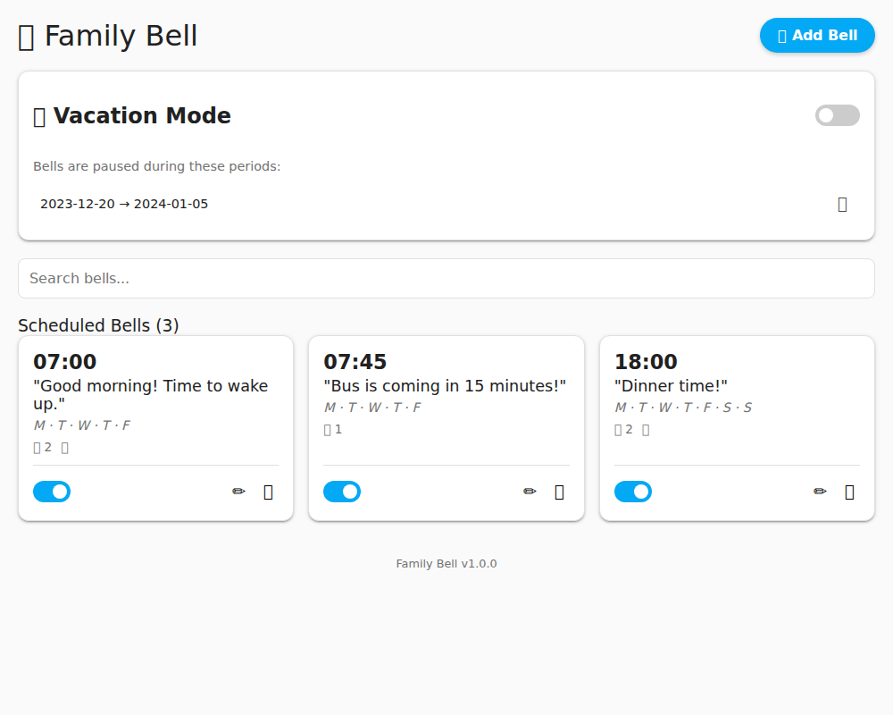

# 🔔 Family Bell for Home Assistant

**Family Bell** is a custom integration that brings the functionality of Google's "Family Bell" directly into Home Assistant. It allows you to schedule recurring announcements on your smart speakers without relying on cloud schedules or specific hardware ecosystems.

*(Note: If you don't have a screenshot yet, you can remove this line until you add one)*

## ✨ Features

* **📅 Custom Schedules:** Create recurring bells (e.g., "School Starts", "Lunch Time") on specific days of the week.
* **📢 Multi-Speaker Support:** targeted announcements to specific media players (Sonos, Google Cast, Alexa via Nabu Casa, etc.).
* **🌴 Vacation Mode:** Easily pause all bells during specific date ranges (Spring Break, Holidays) without deleting them.
* **🗣️ Flexible TTS:** Works with **any** Text-to-Speech engine configured in Home Assistant (Google Translate, Nabu Casa Cloud, Piper, MaryTTS).
* **💻 Native UI Panel:** Includes a dedicated sidebar panel for easy management—no YAML editing required!

## 📥 Installation

### Option 1: HACS (Recommended)
1.  Click the "Open in HACS" badge above **OR** go to HACS > Integrations > 3 dots > **Custom Repositories**.
2.  Add `https://github.com/brewmarsh/family-bell` as a **Integration**.
3.  Click **Download**.
4.  Restart Home Assistant.

### Option 2: Manual Installation
1.  Download the latest release.
2.  Copy the `custom_components/family_bell` folder into your Home Assistant's `config/custom_components/` directory.
3.  Restart Home Assistant.

## ⚙️ Configuration

1.  Navigate to **Settings** > **Devices & Services**.
2.  Click **+ ADD INTEGRATION**.
3.  Search for **Family Bell**.
4.  **Setup Wizard:**
    * **TTS Provider:** Select your preferred speech engine (e.g., `tts.google_en_com` or `tts.piper`).
    * **Voice/Language:** (Optional) Customize the specific voice ID or language.

*Note: You can change the TTS settings later by clicking "Configure" on the integration entry.*

## 🚀 Usage

1.  After installation, look for the **Family Bell** item in your sidebar.
2.  **Add a Bell:**
    * Pick a time.
    * Type a message (e.g., "Time to get your shoes on!").
    * Tap the days of the week to repeat (Mon-Sun).
    * Select the speakers you want to announce on.
    * Click **Save Bell**.
3.  **Vacation Mode:**
    * Toggle "Vacation Mode" ON.
    * Select a Start Date and End Date.
    * All bells will be suppressed during this window.

## ❓ FAQ

**Q: Does this work if my internet is down?**
A: Yes! If you use a local TTS engine (like Piper) and local media players, this runs 100% locally.

**Q: Can I play a sound effect before the text?**
A: Currently, it speaks the text immediately. Sound effect support (chimes) is planned for a future release.

## 🤝 Contributing

Contributions are welcome! Please feel free to submit a Pull Request.

## 📄 License

This project is licensed under the MIT License - see the [LICENSE](LICENSE) file for details.
